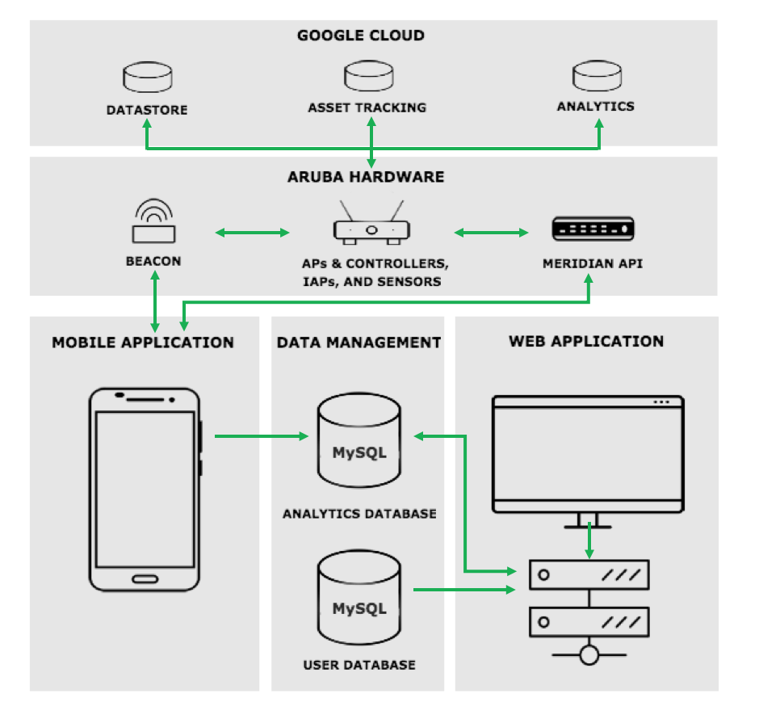

# Indoor Navigation: Improved Accessibility for People with Disabilities

This project was generated with [Angular CLI](https://github.com/angular/angular-cli) version 7.0.6.

## Project Background and Description
The primary purpose of this project is to improve upon the previous generation of the Indoor Navigation Mobile Application that was created for the Parkview Regional Medical Campus (PRMC) in Fort Wayne, Indiana. PRMC is invested in improving the patient experience and is a leading institution in the medical industry. This project aims to utilize new technologies with a focus on the patient experience to keep PRMC ahead of the competitors. The application currently uses Bluetooth low energy to power the real-time positioning functionality of the application creating an easy to understand navigation system. 

## Project Aspirations and Description
This iteration of the project will focus on three key features web development, targeted advertisements, and improved mobile application navigation. These include web development utilizing data and business analytics, targeted advertisements that will promote Parkview technologies, and improved mobile application navigation to assisted disabled patients. Each feature serves to enhance PRMC's quality of service, revenue generation, and modern appeal.
  
## Project Scope Description - Web Application Development

   - Problem   : Information in the database is not currently used.
   - Reason    : Hospital patient’s location and database data can be efficiently managed to help guide patients.
                  * Example Data: Age, Time,  Handicapped  
   - Solution
  Development of a Web Application that presents analyzed data to administrative staff in a comprehensive manner and allowing the data to be manipulated or viewed in many different formats and the Web application is only for staff members.   
  For example, using the webpage the Parkview staff could determine what time are most populated, and by which age group or gender. This would allow for an in-depth look at particular patient demographics, giving Parkview the tools to improve upon their already great services.

## Development server

Run `ng serve` for a dev server. Navigate to `http://localhost:4200/`. The app will automatically reload if you change any of the source files.

## Code scaffolding

Run `ng generate component component-name` to generate a new component. You can also use `ng generate directive|pipe|service|class|guard|interface|enum|module`.

## Build

Run `ng build` to build the project. The build artifacts will be stored in the `dist/` directory. Use the `--prod` flag for a production build.

## Running unit tests

Run `ng test` to execute the unit tests via [Karma](https://karma-runner.github.io).

## Running end-to-end tests

Run `ng e2e` to execute the end-to-end tests via [Protractor](http://www.protractortest.org/).

## Screenshot
Parkview Analytics Main login Page

Heat Map Page

Routing Map Page

SW Diagram

## Further help

To get more help on the Angular CLI use `ng help` or go check out the [Angular CLI README](https://github.com/angular/angular-cli/blob/master/README.md).
# Team7_PFW_Capstone
